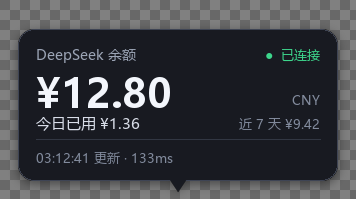
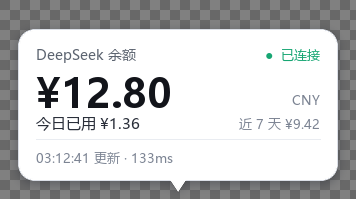
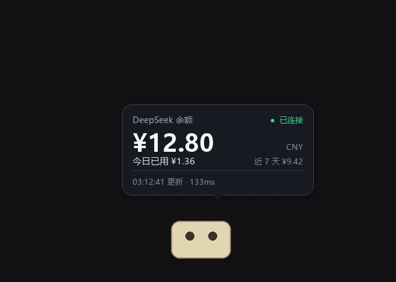
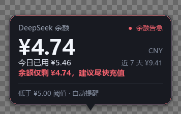
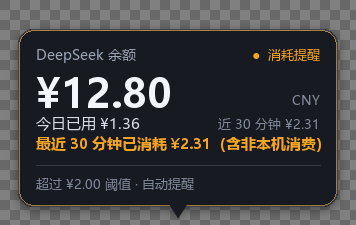

# 赛博财务管家 · Codex 桌宠 DeepSeek 余额面板


给 Codex 原生桌宠加一个"点一下就报账"的能力：**点击桌宠 → 弹出气泡 →
实时余额 + 今日已用金额**。不改动 Codex 本体，不替换你的桌宠皮肤。

> **适用场景：DeepSeek 接入的 Codex（deepseek-codex）。** 余额接口、价格表、
> rollout 记账都按 `api.deepseek.com` 设计；API Key 直接复用 Codex
> `config.toml` 里 `[model_providers.deepseek]` 的配置，所以只要你平时就是用
> DeepSeek 跑 Codex，不需要再填任何东西。

```
SKILL.md                 技能定义：何时使用、硬性规则、模块地图
agents/openai.yaml       Codex UI 元数据
finance_pet/             主程序包（余额、账本、计价、提醒、气泡、窗口）
run.ps1                  启动 / 校准 / 自启 / 预览 / 测试
run_pet.py               自启动快捷方式指向的入口
config.example.json      全部可配置项
tests/                   31 个单元测试
```




（图中为 `python -m finance_pet --preview` 导出的渲染样张，棋盘格代表透明区域。）

界面预览（合成示意图：气泡贴在桌宠上方，尾巴指向桌宠；余额为示例数字）：



---

## 1. 为什么是"挂件"而不是改桌宠

先把调研结论说清楚，避免走弯路。

Codex 的桌宠是一套**纯声明式的精灵图资源**：`~/.codex/pets/<名字>/pet.json`
里只有 `id` / `displayName` / `description` / `spriteVersionNumber` /
`spritesheetPath`，配合一张 8×11 的图集。清单里**没有任何脚本、事件或
回调字段**，也就是说官方没有为桌宠开放 `onClick` 之类的扩展点。
（桌面端本身是 MSIX 安装的 Electron 应用，改 `app.asar` 既会被更新覆盖，
也没有持久化的意义。）

但它有一个可以利用的事实：**桌宠是一个独立的置顶覆盖窗口**，Codex 会把
它的几何信息写进 `~/.codex/.codex-global-state.json`，例如

```json
"electron-avatar-overlay-bounds": {
  "x": 2104, "y": 873, "displayId": 1060407849,
  "anchor": { "x": 2266, "y": 1005, "width": 166, "height": 180 },
  "mascot": { "left": 162, "top": 132, "width": 166, "height": 180 }
}
```

于是本方案改为：**外部进程 + 像素级对齐**。

1. 读全局状态（或直接枚举窗口）拿到桌宠的精确屏幕矩形；
2. 用全局鼠标钩子监听"左键按下且落在这个矩形内" —— 效果等价于 `pet.onClick`；
3. 在桌宠正上方弹出一个无边框、置顶、逐像素透明的气泡。

好处是零侵入、可随时卸载、Codex 升级也不会失效。

---

## 2. 架构与数据流

```
┌─ 点击桌宠 ─────────────────────────────────────────────┐
│  click_hook   WH_MOUSE_LL 全局钩子                      │
│      │  命中 pet_locator 给出的矩形？                    │
│      ▼                                                  │
│  service.collect_snapshot()                             │
│      ├─ balance.fetch_balance()   GET /user/balance     │
│      │     └─ 失败 → 读 balance_cache.json 兜底          │
│      └─ codex_usage.scan_sessions()                     │
│            └─ 增量扫描 ~/.codex/sessions/**/rollout-*.jsonl│
│                 └─ ledger(SQLite) 累计今日 / 近 7 天      │
│      ▼                                                  │
│  bubble.compose()  画成 RGBA 卡片                        │
│      ▼                                                  │
│  win32_window.UpdateLayeredWindow()  贴到桌面            │
└─────────────────────────────────────────────────────────┘
```

| 模块 | 职责 |
| --- | --- |
| `config.py` | 配置合并、**安全读取 API Key**（环境变量 → config.json → Codex `config.toml`） |
| `balance.py` | 余额接口、错误文案、缓存与降级 |
| `codex_usage.py` | 增量解析 rollout 日志，抽取每次调用的 token |
| `pricing.py` | 价格表、峰谷时段、token → 金额 |
| `ledger.py` | SQLite 账本（幂等去重）、今日 / 区间汇总 |
| `pet_locator.py` | 定位桌宠：窗口枚举 → global-state → 手动校准 |
| `click_hook.py` | `WH_MOUSE_LL` 钩子 + 备用全局快捷键 |
| `bubble.py` | 气泡渲染（Pillow），同时用于导出预览图 |
| `win32_window.py` | 原生分层窗口：置顶、透明、不抢焦点、按钮命中 |
| `service.py` | 把上面这些组合成一份 UI 可直接渲染的快照 |

---

## 3. 快速开始

> 唯一的外部依赖是 **Pillow**（渲染气泡用）。Codex 自带的 Python 运行时
> 已经包含 Pillow 与 tkinter 之外的一切，脚本会优先使用它。

先把这个仓库装成 Codex skill（`SKILL.md` 需要位于 skill 根目录）：

```powershell
git clone https://github.com/EASONLIN7/deepseek-finance-pet "$env:USERPROFILE\.codex\skills\deepseek-finance-pet"
cd "$env:USERPROFILE\.codex\skills\deepseek-finance-pet"
```

然后：

```powershell
.\run.ps1 -AutoDetect  # 1) 自动校准桌宠位置（只需做一次）
.\run.ps1 -Install     # 2) 设置开机自启，并立即启动
.\run.ps1 -Status      # 3) 确认在运行：应显示"运行中：1 个进程"
```

装好之后就是常驻的：开机自动启动，点桌宠随时出余额。不想让它自启就
`.\run.ps1 -Uninstall`（同时会停掉当前进程）。

不想用脚本也可以直接跑：

```powershell
$env:PYTHONPATH = "<仓库目录>"
python -m finance_pet
```

程序带单实例保护：重复启动不会装两个钩子，只会提示"已经在运行"。

**不需要单独配置 API Key。** 只要你的 Codex 已经在用 DeepSeek，密钥就会从
`~/.codex/config.toml` 的 `[model_providers.deepseek].experimental_bearer_token`
里自动读取；读取来源会打印在启动日志里（只显示来源，不显示密钥本身）。

---

## 4. 配置

把 `config.example.json` 复制到 `%CODEX_HOME%\finance-pet\config.json`
（默认即 `C:\Users\<你>\.codex\finance-pet\config.json`）后按需修改。
**所有字段都可省略**，省略即用默认值。

常用的几项：

| 字段 | 默认 | 说明 |
| --- | --- | --- |
| `api_key` | 空 | 留空即自动用 Codex 的 Key；也可用环境变量 `DEEPSEEK_API_KEY` |
| `theme` | `"auto"` | `auto` 跟随 Codex 的 `appearanceTheme`，也可固定 `dark` / `light` |
| `auto_hide_seconds` | `3` | 点击弹出的气泡自动消失时间；设为 `0` 则一直停留 |
| `alert_hide_seconds` | `8` | 主动提醒的气泡停留时间 |
| `width` | `320` | 气泡宽度（像素） |
| `offset` | `8` | 气泡与桌宠的间距 |
| `follow_drag` | `true` | 拖动桌宠时气泡实时跟随；设 `false` 则停在原地 |
| `hotkey` | `"ctrl+alt+b"` | 备用全局快捷键；设 `null` 关闭 |
| `mascot_rect` | `null` | 手动指定桌宠矩形 `[x, y, w, h]`，见下一节 |
| `mascot_offset` | 自动生成 | 叠加在自动定位结果上的修正量，由 `-AutoDetect` 写入 |
| `fx_usd_cny` | `7.1` | 官方按美元计价，这里折算成人民币展示 |
| `pricing` | 官方价 | 覆盖价格表（USD / 1M tokens 的 peak 价） |

### 主动提醒

除了"点一下才看"，挂件还会每隔 `alerts_poll_seconds`（默认 90 秒）自检，
命中条件就自己弹气泡：

| 字段 | 默认 | 说明 |
| --- | --- | --- |
| `alerts_enabled` | `true` | 总开关 |
| `low_balance_threshold` | `5` | **余额低于该值**弹窗，红色高亮 |
| `low_balance_cooldown_minutes` | `60` | 同一条提醒的冷却时间 |
| `burst_window_minutes` | `30` | **短时大额消耗**的观察窗口：最近 30 分钟 |
| `burst_threshold` | `2` | 窗口内消耗超过该金额就提醒（元） |
| `burst_cooldown_minutes` | `30` | 同上 |

消耗金额取两者较大值：**本地账本**（Codex 在本机产生的用量，精确到每次调用）
和**余额采样落差**（覆盖你在网页版、其它工具上的消费）。后者命中时提示里会标
「含非本机消费」。

```json
{
  "low_balance_threshold": 5,
  "burst_window_minutes": 30,
  "burst_threshold": 2,
  "alerts_poll_seconds": 90
}
```

不想被提醒就把 `alerts_enabled` 设成 `false`，或者把阈值调到你无感的水平。

也支持环境变量快速覆盖：`FINANCE_PET_DATA_DIR`（数据目录）、
`FINANCE_PET_GLOBAL_STATE`、`FINANCE_PET_HOTKEY`、`FINANCE_PET_DEBUG=1`（调试日志）。

### 数据放在哪

```
~/.codex/finance-pet/
├── config.json          # 你的配置（可选）
├── finance.db           # SQLite 账本
└── balance_cache.json   # 最后一次成功的余额
```

---

## 5. 校准桌宠位置

自动定位分三级：**窗口枚举 → global-state → 手动校准**。

实测（Codex 26.930 / Windows）：桌宠是绘制在 Codex 主窗口右下角的，**不是**
独立的顶层窗口，所以窗口枚举通常拿不到它，实际生效的是第二级——
`.codex-global-state.json` 里的 `electron-avatar-overlay-bounds`。这个矩形来自
官方，能跟上拖动和换屏，但精灵图单元格本身有透明内边距，视觉上会偏一二十像素。

**所以第一次使用请先做一次自动校准：**

```powershell
.\run.ps1 -AutoDetect
```

它连续抓十几帧屏幕做"动画差分"——桌宠待机时仍在呼吸/摆动，周围界面是静止的，
变化的那一团就是桌宠本体。校准结果以**偏移量**形式写入配置：

```json
"mascot_offset": [4, 31, -62, -113]
```

存偏移而不是固定坐标，是为了桌宠被拖动、换显示器之后仍能自动跟随。

其它定位相关命令：

```powershell
.\run.ps1 -Where       # 打印当前识别到的矩形与来源
.\run.ps1 -Calibrate   # 兜底方案：30 秒内手动点一下桌宠
```

配置里的 `click_padding`（默认 10px）用于放宽点击判定；程序也会把自己设为
DPI 感知，避免缩放屏幕上坐标整体错位。

### 拖动桌宠时气泡会跟着走

气泡显示期间，主循环每 33ms 对齐一次位置，所以拖动桌宠它会一路跟随。
两种信息源配合使用：

* **鼠标位移**——按下桌宠那一刻记住锚点，之后按指针位移实时移动气泡，
  不依赖 Codex 什么时候把新坐标写进状态文件，所以拖起来是连续的；
* **Codex 坐标**——一旦状态文件更新（拖动中或拖完），立刻改用官方坐标对齐，
  避免误差累积。

松手后会强制重新读一次坐标做最终对齐。位置只做平移，不会重新渲染贴图，
所以跟随过程几乎不占 CPU；只有"上方空间不够、尾巴要翻面"时才重画一次。

不想让它跟随就把 `follow_drag` 设成 `false`。

---

## 6. 气泡内容与状态

气泡固定展示四行信息，外加一个状态灯：

| 位置 | 内容 |
| --- | --- |
| 标题 | `DeepSeek 余额`，右上角是连接状态灯 |
| 主数字 | 当前总余额，带货币符号，如 `¥12.80` |
| 次级 | `今日已用 ¥X.XX`（来自本地账本），右侧是 `近 7 天 ¥Y.YY` |
| 页脚 | 更新时间与接口耗时，或错误原因 |

状态灯有四种情形：

| 状态 | 表现 | 行为 |
| --- | --- | --- |
| `已连接`（绿） | 正常 | 实时数据，页脚显示耗时 |
| `查询中`（橙） | 点击瞬间 | 先用上一次缓存垫底，避免闪烁 |
| `缓存`（橙） | 网络失败但有历史数据 | **显示上次余额 + 重试按钮**，并标注"3 分钟前的数据" |
| `离线`（红） | 网络失败且无缓存 | 显示友好错误文案 + 重试按钮 |
| `余额告急`（红） | 余额低于阈值 | **自动弹出**，带红色高亮提示行与充值建议 |
| `消耗提醒`（橙） | 窗口内消耗超阈值 | **自动弹出**，带橙色高亮提示行与金额 |

两种主动提醒的样子：




点气泡上的**重试**按钮会立即重新拉取；点气泡其它位置则关闭气泡。
没有网络时不会卡界面，也不会崩溃——所有异常都在 `balance.py` 里被转成文案。

---

## 7. 计价口径

金额来自 Codex 自己写的 rollout 日志（`token_usage_record.usage`），
拆成 DeepSeek 的三档计价：

- `cached_input_tokens` → cache-hit 价
- `input_tokens - cached_input_tokens` → cache-miss 价
- `output_tokens` → output 价

价格表默认取自官方 "Models & Pricing"（USD / 1M tokens，peak 价）：

| 模型 | cache-hit | cache-miss | output |
| --- | --- | --- | --- |
| `deepseek-flash` | 0.006 | 0.30 | 1.20 |
| `deepseek-v4-pro` | 0.044 | 1.32 | 3.96 |

错峰时段价格**恰为峰值的一半**，峰时定义为 UTC 周一至周五
`01:00–04:00` 与 `06:00–10:00`（不含中国法定节假日，可用 `holidays` 补充）。
脚本会按每条记录自己的时间戳判断峰谷，而不是按当前时间。

官方调价后，改 `config.json` 的 `pricing` 即可，无需改代码。

> 说明：这里统计的是 **Codex 在本机产生的用量**。如果你还在别处用了同一个
> Key（网页版、其它工具），"今日已用"不会包含那部分——以余额接口为准。

---

## 8. 文件结构

```
deepseek-finance-pet/
├── README.md
├── run.ps1                 # 启动 / 校准 / 自启 / 预览 / 测试
├── run_pet.py              # 自启动快捷方式指向的入口
├── config.example.json
├── docs/                   # 气泡渲染样张
├── finance_pet/            # 主程序包
│   └── screen_probe.py     # 动画差分自动定位
└── tests/test_finance_pet.py
```

---

## 9. 测试

```powershell
.\run.ps1 -Test
# 或
python -m unittest discover -s tests -t . -v
```

覆盖：峰谷判定与金额换算、账本幂等与增量扫描、余额缓存降级、
global-state 各种几何字段的解析、API Key 的读取优先级与不泄露。

---

## 10. 已知限制

- **仅在 Windows 上可用**（依赖 `WH_MOUSE_LL` 与分层窗口）。渲染与记账部分
  是跨平台的，换平台只需替换 `win32_window.py` / `click_hook.py`。
- **必须让挂件处于运行状态**：桌宠本身不联网也不记账，是挂件在监听点击。
  用 `.\run.ps1 -Status` 确认在跑；建议 `-Install` 设为开机自启。
- 钩子只监听左键**按下**，并做了 250ms 节流；在桌宠上双击只会触发一次。
- 桌宠被隐藏时不会触发（`electron-avatar-overlay-open` 为 false）。
- 鼠标钩子是全局的，但只对落在桌宠矩形内的点击做反应；不会记录其它输入。
- 需要 Pillow。若用系统 Python 而非 Codex 自带运行时：
  `python -m pip install pillow`。

---

## 11. 点桌宠没反应？按顺序检查

```powershell
.\run.ps1 -Status          # 1. 是否"运行中"？没有就先 .\run.ps1 -Install
.\run.ps1 -Where           # 2. 矩形是否覆盖在桌宠身上？不覆盖就 -AutoDetect
.\run.ps1 -Console -Show   # 3. 前台打开，会打印每次点击事件（-Show 先弹一次气泡，确认渲染没问题）
```

第三步如果能看到 `[debug] hook event=click ...`（需先设 `$env:FINANCE_PET_DEBUG=1`）
却依然不弹窗，那就是窗口渲染问题，把日志发我。
